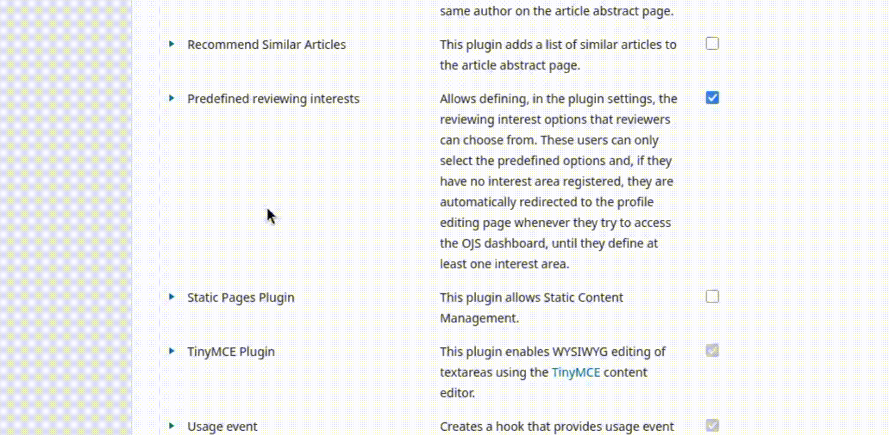

# Predefined reviewing interests

This plugin replaces the reviewing interests field with a **predefined list of options** configured in plugin settings.

## What the plugin does

- **You define the options.** In the plugin settings you create the list of reviewing interests that will be available in your journal (for example: _Public Health_, _Machine Learning_, _Medieval History_).
- **Reviewers select instead of type.** On the user's profile page, the interests field becomes a multi-select field. Reviewers can pick one or more options, but they can only choose from your predefined list.
- **Reviewers are nudged to fill it in.** A reviewer who has no interest selected is automatically redirected to their profile page when they try to enter the dashboard, with a message explaining that they must select at least one interest before continuing.
- **The interests field is hidden during registration.** To keep the public sign-up form simple, the free-text reviewing interests field is removed from the registration page. Reviewers fill in their interests later, from the predefined list, on their profile.
- **Editors can filter reviewers by interest.** When selecting a reviewer for a submission, editors get a "Filter by reviewing interest" option in the reviewer panel, so they can quickly narrow the list down to reviewers with the relevant expertise.

> **Note:** The plugin only takes effect once you have configured at least one interest option. Until then, OJS keeps its default field behavior.

## How to use it

1. Go to `Settings` > `Website` > `Plugins`, find **Predefined reviewing interests** and enable it.
2. Open the plugin settings and add the interest options you want to offer in your journal.
3. That's it — reviewers will now select their interests from your list, and editors can filter by them.

## Compatibility

This plugin is compatible with OJS in the following versions:

- 3.3.0.x (v1)
- 3.4.0.x (v2)
- 3.5.0.x (v2)

## Plugin Download

To download the plugin, go to the Releases page and download the tar.gz package of the latest release.

## Installation

Enter the administration area of ​​your OJS website through the Dashboard.
Navigate to `Settings` > `Website` > `Plugins` > `Upload a new plugin`.

Under Upload file select the file `selectionOfReviewingInterests.tar.gz`.

Click Save and the plugin will be installed on your website.

## License

This plugin is licensed under the GNU General Public License v3.0

_Copyright (c) 2025-2026 Lepidus Tecnologia_
