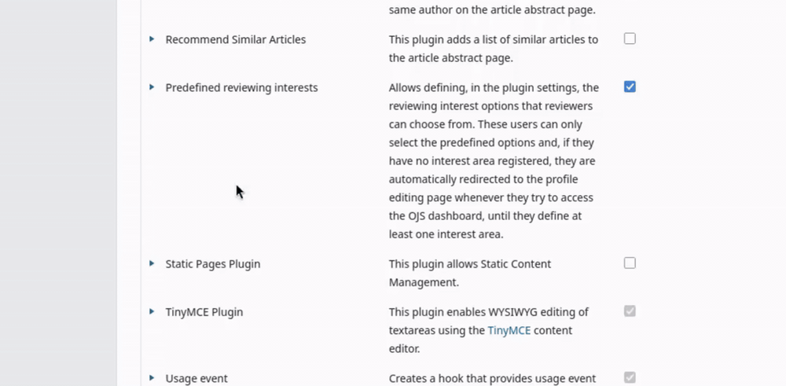

[English](/README.md) | [Português Brasileiro](/docs/README-pt_BR.md) | **Español**

# Intereses de revisión predefinidos

Este módulo reemplaza el campo de intereses de revisión por una **lista predefinida de opciones**.

## Qué hace el módulo

- **El editor define los intereses de revisión posibles.** En los ajustes del módulo, el editor crea la lista de intereses de revisión que estará disponible en la revista (por ejemplo: _Salud Pública_, _Aprendizaje Automático_, _Historia Medieval_).
- **Los revisores seleccionan en lugar de escribir.** En la página de perfil del usuario, el campo de intereses se convierte en un campo de selección múltiple. Los revisores pueden elegir una o más opciones, pero solo a partir de su lista predefinida.
- **Se anima a los revisores a completarlo.** Un revisor que no tenga ningún interés seleccionado es redirigido automáticamente a su página de perfil cuando intenta entrar al panel de control, con un mensaje que le explica que debe seleccionar al menos un interés antes de continuar.
- **El campo de intereses se oculta durante el registro.** Para mantener simple el formulario público de registro, el campo de texto libre de intereses de revisión se elimina de la página de registro. Los revisores completan sus intereses después, a partir de la lista predefinida, en su perfil.
- **Los editores pueden filtrar revisores por interés.** Al seleccionar un revisor para un envío, los editores disponen de la opción "Filtrar por intereses de revisión" en el panel de revisores, de modo que pueden reducir rápidamente la lista a los revisores con la experiencia relevante.

> **Nota:** El módulo solo entra en vigor una vez que haya configurado al menos una opción de interés. Hasta entonces, OJS mantiene el comportamiento predeterminado del campo.

> **Nota:** Los intereses de revisión que se completaron antes de la activación del módulo permanecen registrados y se siguen mostrando en el campo de intereses. Con el módulo activado y configurado, los revisores solo pueden agregar intereses a partir de la lista predefinida, pero los que ya habían registrado anteriormente se mantienen (y aún pueden eliminarse).

## Compatibilidad

Este módulo es compatible con OJS en las siguientes versiones:

- 3.3.0.x (v1)
- 3.4.0.x (v2)
- 3.5.0.x (v3)

## Instalación

Vaya a *Ajustes -> Sitio web -> Módulos -> Galería de módulos*. Haga clic en **Intereses de revisión predefinidos** y luego en *Instalar*.

## Cómo usarlo

1. Vaya a `Ajustes` > `Sitio web` > `Módulos`, busque **Intereses de revisión predefinidos** y actívelo.
2. Abra los ajustes del módulo y agregue las opciones de interés que desea ofrecer en su revista.
3. Eso es todo — los revisores ahora seleccionarán sus intereses a partir de su lista, y los editores podrán filtrarlos por interés.

## Licencia

Este módulo está licenciado bajo la GNU General Public License v3.0

_Copyright (c) 2025-2026 Lepidus Tecnologia_
